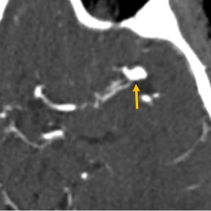
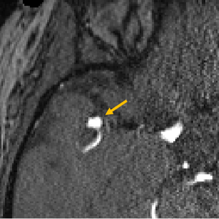
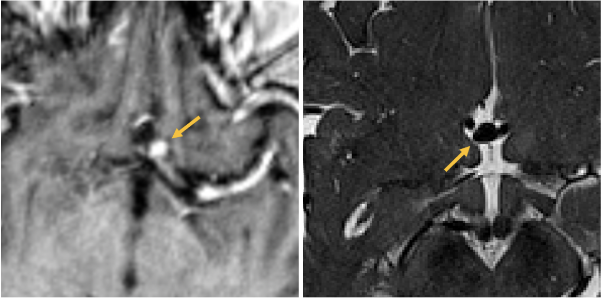

# Aneurysm Detection: Initial Report and Exploratory Data Analysis

### Background
This is part 1 of my capstone project for UC Berkeley's [Professional Certificate in Machine Learning and Artificial Intelligence](https://em-executive.berkeley.edu/professional-certificate-machine-learning-artificial-intelligence?v=v2&program_sfid=01t2s000000ZqNbAAK&advocate_program=01t2s000000ZqNbAAK&advocate_source=canvas_nav&coupon=KYLED%3A11-92JJB59&utm_campaign=incentivized_referrals&utm_content=SO%20-%20Berkeley%20Professional%20Certificate%20in%20ML%20%26%20AI&utm_medium=personal_url&utm_placement=canvas_nav&utm_source=referral&utm_term=zEEi4r45qhY62BxFl0dUlx54cfhknCsT9ELNonRLPRc%3D#referrals-email-capture-modal) program. I chose this project after hearing about Kaggle's open [Intercranial Aneurysm Detection Competition](https://www.kaggle.com/competitions/rsna-intracranial-aneurysm-detection), hosted by the Radiological Society of North America, which has a prize pool of $50,000 USD. This competition has the goal of using crowdsourcing to find a very strong aneurysm detection algorithm that can be implemented in real-life settings such as hospitals. This has the potential to be life-saving, as a very strong aneurysm detection algorithm implemented in real-world setting could potentially catch aneurysms that may otherwise have gone unnoticed. Catching aneurysms early is enormously important, as an untreated aneurysm can be deadly, but there are often minimally invasive treatments available when an aneurysm is detected early. One of the competition hosts, Maria Correia de Verdier, wrote an [excellent article](https://www.kaggle.com/competitions/rsna-intracranial-aneurysm-detection/discussion/591648) detailing the clinical problem for those interested in learning more.

On the engineering side, the problem that I and other entrants to the competition are tasked with is to build an image classification algorithm that can tell the difference between an image of a brain with a visible aneurysm, and an image of a brain without a visible aneurysm. The competition provides a large dataset of brain images taken using a variety of medical imaging technologies (MRA, CTA, MRI) and labels them according to whether they have an aneurysm present. Our competition entry will be graded using a hidden test set that will not be publicly revealed until all entries are submitted and the competition is over (the deadline for submissions is October 14th, 2025). This prevents entrants from being rewarded for overfitting their model onto the training data, as there will be no way for the hidden test data to influence training or model architecture decisions.

On a quick personal note - I feel I may have been a bit overly ambitious in choosing to take on this competition for my final project. Most of the course covered classical machine learning techniques and we only spent a few weeks on deep learning and image classification. (I actually just enrolled in a new course, [Deep Learning: Mastering Neural Networks](https://programs.xpromit.com/deep-learning?v=v2&program_sfid=01tAy000000FvYFIA0&advocate_program=01tAy000000FvYFIA0&advocate_source=dashboard&coupon=KYLED-13HDK4FE3ALM&utm_campaign=incentivized_referrals&utm_content=OEP%20-%20MXP%20Deep%20Learning%20ENG%20GA&utm_medium=personal_url&utm_placement=dashboard&utm_source=referral&utm_term=zEEi4r45qhY62BxFl0dUlx54cfhknCsT9ELNonRLPRc%3D#referrals-email-capture-modal) as I feel I need to gain more experience and education in neural network design.) Nevertheless, I will try my best and am sure that this will prove to be an interesting and educational experience however it turns out.

### Example Images

So what does an aneurysm actually look like in a medical image of the brain? The aforementioned [article](https://www.kaggle.com/competitions/rsna-intracranial-aneurysm-detection/discussion/591648) by de Verdier provides some examples:

1. CT angiography (CTA)

*CT angiography (CTA) is a non-invasive technique that enables visualization of the blood vessels. It offers several advantages over DSA, including the ability to also assess non-vascular tissues, such as the brain tissue. Additionally, it is less expensive, faster, and presents a lower risk to the patient because it does not require insertion of a catheter into the cerebral arteries. Despite its benefits, CTA has a few limitations compared to DSA. It cannot selectively image individual vessels, and because it images the vessels at a single time point, it limits the evaluation of flow-related features. CTA also has a lower spatial resolution, making it more difficult to detect small aneurysms.*

*Below: middle cerebral artery aneurysm visible on CTA*

2. MR angiography (MRA)

*Compared to MR angiography (MRA), CTA's main disadvantage is the use of both ionizing radiation and intravenous iodinated contrast. MRA is a valuable alternative to both CTA and DSA. It avoids the use of ionizing radiation and iodinated contrast agents, and typically does not require intravenous contrast of any type. However, MRA has limitations including lower spatial resolution, longer scan times, and contraindications in patients with some implants such as certain types of heart devices. MRA has evolved into both contrast-enhanced and non-contrast enhanced MRA techniques, each with specific advantages and clinical applications.*

*Below: middle cerebral artery aneurysm visible on MRA*

3. Magnetic resonance imaging (MRI)

*In addition to CTA and MRA, the dataset also includes T1 post-contrast and T2-weighted magnetic resonance imaging (MRI). Although these sequences are not typically used in clinical practice to evaluate the presence of aneurysms, aneurysms may still be visible on them. MRI examinations are performed much more frequently than MRA studies, and including these sequences in the challenge dataset provides an opportunity to explore aneurysm detection from more commonly acquired imaging (e.g. opportunistic screening)*

*Below: anterior communicating artery aneurysm visible on T1 post-contrast and T2-weighted MRI*

The dataset we are provided with for the competition contains many such images, as well as many images where no aneurysm is present. We are also provided with some supplementary data such as basic demographic info about the patients, as well as information about where in the brain the aneurysms are located in the provided images, which is a really interesting detail. To fully understand the data, I used the attached [Jupyter notebook](notebook.ipynb) to complete an exploratory data analysis. Please consult the notebook for the full analysis, but I have also provided an overview of the key information below.

### Exploratory Data Analysis

The data for the competition can be downloaded as a zip file from the [competition site](https://www.kaggle.com/competitions/rsna-intracranial-aneurysm-detection/data). The zip file is over 200 GB and contains over 1 million image files, so I have downloaded and extracted the image data locally but not included the images in this GitHub repository, so that I don't have to upload hundreds of gigabytes of images.

The provided dataset also includes 2 tables, `train.csv` and `train_localizers.csv`, which I have included in this repository, in the `data` folder. These tables are very important, as they identify which images belong to which patient and which images contain a visible aneurysm.

There are over 1 million images in the dataset, but that does not mean there are 1 million patients. `train.csv` contains 1 row per patient and contains 4,348 rows. For each patient, we are told their age and sex. This table also tells us the "SeriesInstancedUID" corresponding to that patient. This points us to the folder in which that patient's images are stored, in the `series/SeriesInstanceUID` directory. (But, as I mentioned before, those directories are not actually present in this remote GitHub repository due to their prohibitive size).

In each of these individual directories, each corresponding to a single patient, we will generally find hundreds of images, each taken of slightly different cross-sections of the brain. Even if a patient does have one or more aneurysms, the aneurysm may only show up in one or a few of the images in this folder.

This is where `train_localizers.csv` comes in. This table points to specific *images* in which aneurysms are visible, and even provides coordinates of exactly where in that image the aneurysm is present.

There are 2,250 rows in `train_localizers.csv`, pointing to 1,863 unique patients, and 2,214 unique images pointers. What this means is that there are 1,863 patients with at least one aneurysm out of the total of 4,348 present in `train.csv`. The discrepancies in the numbers here are because some of the patients have multiple aneurysms, in which case there may be multiple images that show aneurysms; in addition, a very select few of the images show more than one aneurysm; additionally, sometimes an aneurysm is present in multiple images. This is all kind of confusing, but the important part for starting out with this project is just to recognize each row in `train_localizers.csv` points to 1 specific image in which in an aneurysm is definitely present. For all of the other ~1 million images that are not referenced in `train_localizers.csv`, I believe we are to presume that they do not have a visible aneurysm.

One of the perks of a competition like this is that the data has already been very carefully prepared and cleaned. In fact, the dataset has already been modified a couple times by the competition hosts to clean up some small issues identified by participants. So, as a data scientist, I am saved from having to work hard to filter out garbage data, fill in missing values, and so on.

Nevertheless, there are still some major challenges I will have to work through when trying to manage this dataset. First of all, ~1 million images is just a huge amount of images to deal with. And these images are in the DICOM format, which is a specialized imaging format that may be more difficult to work with than a more standard image format.

One idea that immediately comes to mind regarding how to deal with such a large dataset is that we likely do not need to use anywhere near the full 1 million images to train the image classification model. Out of these 1 million images, only 2,214 actually contain an aneurysm. My understanding from what I have learned is that it is generally beneficial to have approximately evenly balanced classes in the training data when trying to train a binary image classification model. This means that as a first try, we could use the 2,214 images that contain an aneurysm, and then select a random sample of approximately 2,200 images from the remaining images that do not contain an aneurysm, and use that subset of approximately 4,500 images to train the model. This will massively reduce the cost and time to train the model by reducing the size of the training data by nearly 3 orders of magnitude, and will hopefully have a relatively small effect on model performance - it may even improve model performance.

Of course, we can try using a larger subset of the images as well. For now, however, my goal is to get an initial model off the ground using reasonable simplifying assumptions. I will use that first model's performance as a baseline and then iterate from there.

#### Inital Steps

In line with the strategy outlined above, my initial engineering roadmap is as follows:

1. Using `train_localizers`, select the 2,214 unique images that contain an aneurysm
2. Using a randomization tool, select 2,214 images out of the remaining control images
3. Collect these images in a single folder called `model_1_images`
4. Create a table called `model_1_train` that contains the relevant information about just these images, collated from both `train` and `train_localizers`
5. In order to make the DICOM images accessible to a classification model, each image will need to be converted into a 3-dimensional pixel array. This will likely require performing research to find a tool that understands DICOM images.
6. Using tensorflow, create a basic convolutional neural network model. Start with something fairly simple - not too many layers and nodes - to act as a baseline comparison for future iterations.
7. Train this basic model and record its performance using a validation set.
8. Iterate on this basic model and explore a variety of architectures and additional feature engineering strategies.

#### Next Steps

After getting an initial model off the ground, the real fun part begins, which is trying a wide variety of strategies to improve the performance of the model. Here are some initial ideas for strategies to try - I welcome any additional ideas and input here!

1. Most image classification models are built on top of a preexisting image classification model, often a large model trained on a large generic dataset like [ImageNet](https://www.image-net.org/). However, it is not clear that this will be particularly useful in a challenge like this, where the images have no recognizable ordinary objects like cars or plants or people etc. However, it is still worth trying if only for science.
2. One alternative option is to use a preexisting *medical* image classification model. I will have to do some research into what models are out there and which would seem to make sense for this challenge.
3. With both of the above options, we could also try fine-tuning the model, which is where the last few layers of the model are "unfrozen" and modified iteratively during the training process, which is another very common strategy in image classification.
4. Another very common strategy to improve the performance of image classification models is data augmentation, which is where additional copies of the images in the training set are created and rotated, distorted, blurred, etc. This may be very important for this dataset, since there are so few images in the original dataset that actually contain an aneurysm; we could multiply that number substantially through data augmentation.

I am sure there are many other strategies to try, and I would welcome any input and ideas. I will add additional thoughts and ideas in this section as I receive suggestions and as I progress through the project.